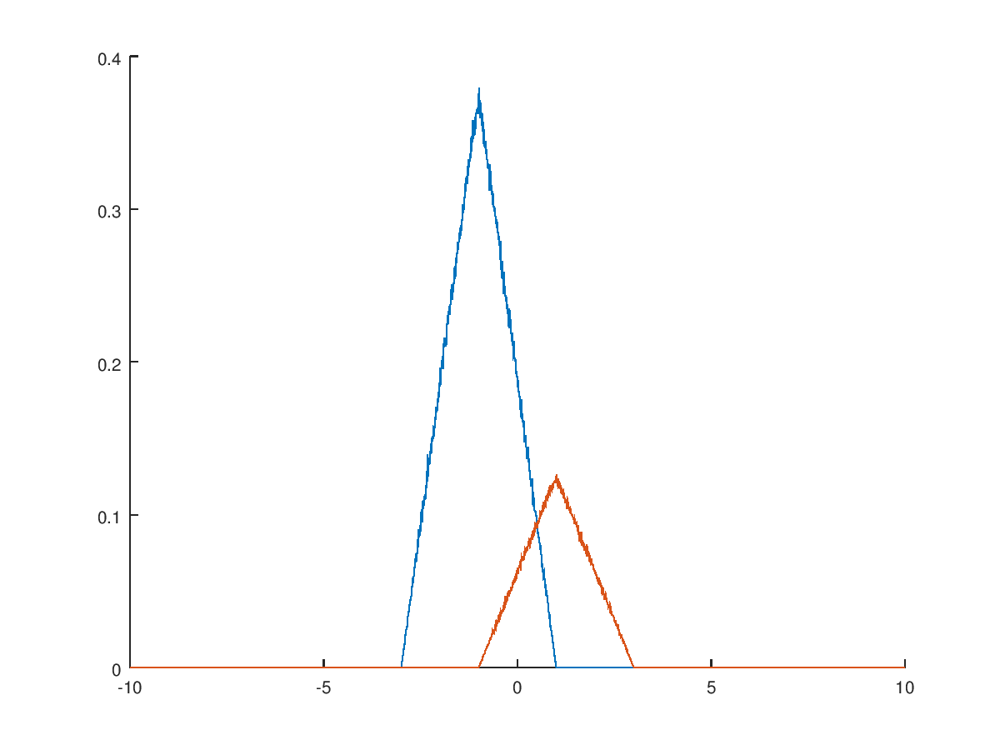

:doctype: book
:firstname: Diego
:lastname: Fernández Barrera
:author: Diego Fernández Barrera
:copyrights: Attribution-NonCommercial-NoDerivatives 4.0 International CC BY-NC-ND 4.0
:lang: es
:docinfo:
:revnumber: 0.1.0
:keywords: comdig, señales
:toc:
:toc-title: Índice
:toclevels: 3
:toc-position: left
:nofooter:
:header:
:icons: font
:table-caption: Tabla
:example-caption: Ejemplo
:listing-caption: Código
:figure-caption: Figura
:stem: latexmath
:source-highlighter: pygments

= Recetas para Comunicaciones Digitales

== Generar una secuencia aleatoria

Siendo latexmath:[N] el número de muestras, para generar una señal aleatoria con
valores latexmath:[\pm 2] equiprobables:

[source, octave]
----
An = 4 * randi([0 1], 1, N) - 2;
----

Podemos representar la secuencia con `stem(An)`.

// TODO Add image
// [.text-center, width="75%"]
// image::images/figure01.png[]

Cuando los valores no son equiprobables, el truco es usar la función `sign()`.
Si las probabilidades están en la forma, por ejemplo, latexmath:[\{6/7, 1/7\}],
habría que generar 7 enteros, desplazar 6 hacia los números negativos (dejando
uno en los positivos) y aplicar la función `sign()`.

[source, octave]
----
An = sign(randi([0 6], N) - 5.5);
----

WARNING: Nótese que hemos restado 5.5 ya que si hubiésemos restado 6, hubiese
habido un valor en 0 y el signo de 0 es 0. Sin embargo, esto puede ser de
utilidad si quisiéramos generar tres valores con diferente probabilidad.

=== Función masa de probabilidad

Podemos calcular su función masa de probabilidad de la siguiente forma:

.Función masa de probabilidad
[source, octave]
----
function [f, Xn] = LCDfmp(X)
  % Número de muestras
  Np = length(X);

  % Se descartan los valores repetidos
  valores = unique(X);

  % Se calcula el histograma
  [fx, Xn] = hist(X, valores);

  % Se divide por el número de puntos
  f = fx/Np;
end
----

Para representarla ejecutamos la siguiente orden:

.Representación de la función masa de probabilidad
[source, octave]
----
[f, Xn] = LCDfmp(An);
stem(Xn, f);
----

// TODO Add image
// [.text-center, width="75%"]
// image::figure02.png[]

== Generar un pulso

// TODO Add image
// .Pulso a generar
// [.text-center, width="50%"]
// image::figure03.png[]

.Generación del pulso en matlab
[source, octave]
----
L = 8; <1>
sn = [a * ones(1,L/2), - a/2 * ones(1,L/2)];
----

<1> Número de muestras

Para generar el pulso anterior, primero debemos calcular el valor de
latexmath:[a] para que la señal tenga energía unidad.

.Calcular la energía de una señal
****
[[energy-cont]]
.Cáclulo de la energía de una señal continua
[latexmath]
++++
E = \int_{-\infty}^{\infty} X(t)^2 dx
++++

[[energy-disc]]
.Cálculo de la energía de una señal discreta
[latexmath]
++++
E = \sum_{n=1}^{L} X_n^2
++++
****

Aplicando <<energy-disc>> sacamos el valor de latexmath:[a].

[latexmath]
++++
1 = 4 a^2 + 4 \left ( \frac{a}{2} \right ) ^2 = 5a^2
\\
a = \sqrt{1/5}
++++

=== Generar un pulso continuo a partir de uno discreto

Si queremos generar un pulso continuo a partir de `s[n]` que conserve la energía
de la señal original y un intervalo de muestreo `Tm` lo haríamos de la siguiente
forma:

[latexmath]
++++
s(t) = \frac{1}{\sqrt{T_m}} \cdot s[n]
++++

[NOTE]
====
Si nos dan el *tiempo de bit* (`Tb`) podemos calcular `Tm` de la siguiente
forma:

[latexmath]
++++
T_m = \frac{T_b}{L}
++++

`L` es el número de muestras.
====

Para generar la señal continua se haría de la siguiente forma:

[source, octave]
----
t = 0:Tm:Tb-Tm; <1>
st = 1/sqrt(Tm) * sn; <2>
plot(t, st); <3>
----

<1> Se define el intervalo donde estará definida la señal continua
<2> Se generan los valores a partir de la señal discreta
<3> Se dibuja

== Cálculo de energía

Para calcular la energía de una señal discreta se puede hacer de la siguiente
forma (hay otras):

[source, octave]
----
E = sn * sn';
----

En el caso de una señal continua equivalente, sería:

[source, octave]
----
E = Tm * st * st';
----

== Cálculo de la función densidad de probabilidad

Para calcular la función densidad de probabilidad de una variable aleatoria
usamos la siguiente función:

.LCDfdp.m
[source, octave]
----
function [fxi,ci] = LCDfdp(X, xpuntos)
  % Número de muestras
  Np = length(X);

  % Número de puntos por defecto
  Npuntos=128;

  % Si se proporciona un segundo parámetro se usará en lugar de valor por defecto
  if nargin > 1
    Npuntos = xpuntos;
  end

  % Se genera un histograma
  [fxi, ci] = hist(X, Npuntos);

  % Se calcula la función aproximada
  fxi = fxi/Np/(ci(2) - ci(1));
end
----

.Cálculo de una FDP
====
Ejemplo de cálculo de la FDP de una normal con varianza 0.3 y media -3:

[source, octave]
----
Np = 1e6; <1>
N = sqrt(0.3) * randn(1, Np) - 3; <2>
nvalues = -10:0.1:10; <3>
[fN, m2, v2] = LCDfdp(N,nvalues); <4>
plot(nvalues, fN); <5>
----

<1> Número de muestras a generar
<2> Generar la variable aleatoria
<3> Definir el intervalo donde está definida la variable aleatoria
<4> Calcular la FDP
<5> Dibujar la FDP
====

== Modular una secuencia usando un pulso

Si tenemos una secuencia aleatoria y queremos usar un pulso conformador para
modularla, lo ideal es unar la función `kron()`.

[source, octave]
----
Xt = kron(An, sn); <1>
stem(Xt);
----

<1> An es la secuencia y sn es el pulso conformador

WARNING: Ojo que el orden de los parámetros en la función `kron()` influye en
el resultado.

== Funciones densidad de probabilidad ponderadas

Tenemos:

* latexmath:[X] una variable aleatoria que toma valores latexmath:[\{+1, -1\}].
* latexmath:[N = N_1 + N_2]. Siendo latexmath:[N_1] y latexmath:[N_2] son dos
  variables aleatorias uniformemente distribuidas entre latexmath:[[-1, 1]].
* latexmath:[Y = X + N]

Representar en una misma gráfica:

* latexmath:[q \cdot f_{Y \mid X = -1}(y \mid X = -1)]
* latexmath:[p \cdot f_{Y \mid X = 1}(y \mid X = 1)]

Siendo latexmath:[p] y latexmath:[q] latexmath:[\{1/4, 3/4\}] respectivamente.

.Resolución
[source, octave]
----
Np = 1e6
p = 1/4;
q = 3/4;

N1 = 2 * rand(1, Np) - 1; <1>
N2 = 2 * rand(1, Np) - 1; <1>
N = N1 + N2; <1>

Y1 = N + 1;  <2>
Y2 = N - 1;  <3>

fdpY1 = LCDfdp(Y1, -10:0.01:10); <4>
fdpY2 = LCDfdp(Y2, -10:0.01:10); <4>

fY1 = p * fdpY1; <5>
fY2 = q * fdpY2; <5>

hold on;
plot(r, fY1);
plot(r, fY2);
hold off;
----

<1> Generar las variables aleatorias uniformes y calcular N
<2> Caso latexmath:[X = 1]
<3> Caso latexmath:[X = -1]
<4> Cálculo de la FDP
<5> Ponderación por su probabilidad de ser transmitidas

[.text-center, width="50%"]
.Representación gráfica

=== Encontrar su frontera

Para encontrar la frontera, es decir el punto en el que se cortan
latexmath:[f_{Y \mid X=-1}] y latexmath:[f_{Y \mid X=1}] podemos usar la función
`find()` de la siguiente forma:

[source, octave]
----
idx = find((fY1 <= fY2) & (fY1 > 0), 1); <1>
g = r(idx); <2>
----

<1> En `idx` tenemos el índice del punto donde se cortan las funciones
<2> En `g` tendríamos el valor de las funciones en ese punto

== Equivalencias

****
Siendo latexmath:[M] el número de símbolos, latexmath:[K] es el número de
bits que corresponden a cada símbolo.

[latexmath]
++++
K = log_2 M
++++
****

.Equivalencia entre bits y símbolos
[cols="3"]
|===
| Número de bits
| latexmath:[N_b]
| latexmath:[K \cdot N_s]

| Régimen binario
| latexmath:[R_b]
| latexmath:[K \cdot R_s]

| Tiempo de bit
| latexmath:[T_b]
| latexmath:[\frac{T_s}{K}]

| Energía de bit
| latexmath:[E_b]
| latexmath:[\frac{E_s}{K}]
|===

NOTE: El tiempo de símbolo es la duración del pulso básico.

El régimen binario es la inversa el tiempo de bit y los baudios la inversa del
tiempo de símbolos:

.Régimen binario y baudios
[latexmath]
++++
T_s = \frac{1}{R_s} \quad T_b = \frac{1}{R_b}
++++

.Tiempo de muestreo
[latexmath]
++++
T_m = \frac{Ts}{L}
++++

.Duración de una señal
[source, octave]
----
Ns = Nb / K; <1>
D = L * Tm * Ns;
----

<1> `Nb` es el número de bits de la señal

== Transmitir una señal PAM

* Parámetros
  ** `Bn`: Vector de bits a transmitir.
  ** `Eb`: Energía de bit.
  ** `M`: Número de símbolos.
  ** `p`: Depende de latexmath:[g(t)]:
    *** latexmath:[g(t)] es paso de baja: latexmath:[p = g(t)]
    *** latexmath:[g(t)] es paso de banda: latexmath:[p = g(t) \cdot cos(\omega_c t)]
  ** `L`: Número de muestras en la señal discreta.
* Retorno
  ** `Xn`: Seañal transmitida.
  ** `Bn`: Lo mismo que se introdujo, pero relleno con ceros si es necesario.
  ** `An`: Vector de símbolos a transmitir.
  ** `phi`: Pulso conformador: Depende de latexmath:[g(t)]:
    *** latexmath:[g(t)] es paso de baja: latexmath:[\phi(t) = \sqrt{\frac{1}{E_g}} g(t)]
    *** latexmath:[g(t)] es paso de banda: latexmath:[\phi(t) = \sqrt{\frac{2}{E_g}} g(t) \cdot cos(\omega_c t)]
  ** `alfabeto`: Vector con los posibles valores de los símbolos.

.Transmitir la señal
[source, octave]
----
K = log2(M);
Es = 5;
Eb = Es/K; <1>
[Xn, Bn, An, phi, alfabeto] = transmisorpam(Bn, Eb, M, p, L);
----

<1> Recordemos que la energía de bit es la energía de símbolo entre el número
de bits por cada símbolo (K).

CAUTION: `p` debe ser una señal discreta, por lo que latexmath:[\omega_c t] pasa
a ser `wc * n`, siendo `n = 1:1:L`.

.Representar `n` símbolos de la señal transmitida
****
[source, octave]
----
t = Tm:Tm:L*Tm*N;
plot(t, Xt(1:N*L));
----

Siendo `N` el número de símbolos a representar
****

.Obtener la señal continua transmitida (4 primeros símbolos)
[source, octave]
----
Xt = Xn / sqrt(Tm);
t = Tm:Tm:L*Tm*4;
plot(t, Xt(1:4*L));
----

.Representar alfabeto
[source, octave]
----
hold on;
plot(alfabeto, 0,'r');
plot(An, 0,'o');
hold off;
----

== Función transmisor PAM

[source, octave]
----
function [Xn,Bn,An,phi,alfabetopam] = transmisorpam(Bn,Eb,M,p, L)
  % ¿Cuántos bits hay en cada símbolo?
  k = ceil(log2(M));

  % Ajustemos M a una potencia de dos
  M = 2^(k);

  % El alfabeto [Ver la ecuación (4.10)]
  alfabetopam=sqrt(3*Eb*log2(M)/(M^2-1))*(2*(1:1:M)-M-1);

  % Si la secuencia Bn no tiene una longitud múltiplo de k, se completa con
  % ceros
  Nb = length(Bn); <1>
  Bn = [Bn, zeros(1, k*ceil(Nb/k) - Nb)];
  Nb = length(Bn); <2>
  Ns = Nb/k; <3>

  % La secuencia generada
  if M > 2
      An=alfabetopam(gray2de(reshape(Bn,k,Nb/k)')+1);
  else
      An=alfabetopam(Bn+1);
  end

  % Comprobación de las longitudes y otros datos del pulso básico para hacer
  % que el número de muestras del mismo sea efectivamente L
  Ls = length(p);
  if Ls<L
      p = [p,zeros(1,L-Ls)];
  else
      disp(['La duración del pulso se ha truncado a ',num2str(L), 'muestras'])
      p = p(1:L);
  end

  % Normalicemos la energía del pulso suministrado para obtener la base del
  % sistema
  phi = (1/sqrt(p*p')) * p;

  % Obtención del tren de pulsos
  Xn = kron(An, phi);
end
----

<1> Número de bits que vamos a transmitir
<2> Número de bits que vamos a transmitir tras la corrección
<3> Número de símbolos que vamos a transmitir

== Probabilidad de error teórica para una SNR

.Tiempo de muestreo
[latexmath]
++++
Q \left( \frac{\sqrt{6 k M E_{bav}}}{(M^2-1) N_{0}} \right)
++++

[source, octave]
----
SNRdb = 16;
SNR = 10^(SNR/10);
No = Eb / SNR;
Pm = 2 * (M - 1) / M * Qfunct(sqrt((6 * k * M * Ebav) / ((M^2 - 1) * No)));
Pb = Pm/k;
----
